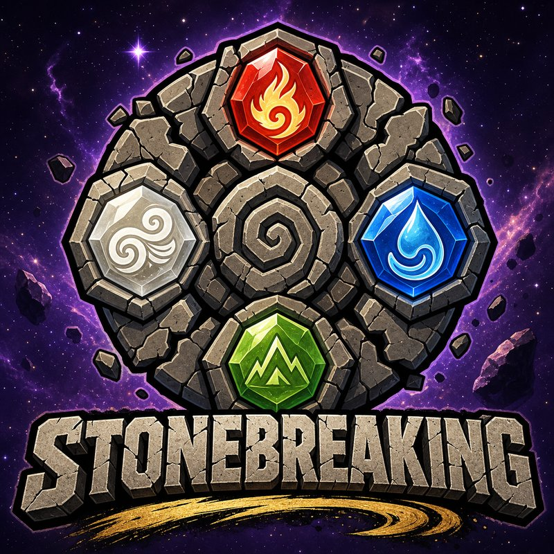

# 🎮 STONEBREAKING — Element Guardians

**Taşkıran'ın Efsanesi** · Oynanabilir prototip (TR / EN)

🔗 **Canlı demo:** https://stonebreaking.github.io/



---

## Ne bu?

Mahjong Solitaire mekaniğinin element temalı, IQ ölçümlü ve aile odaklı evrimi.
Oyuncu **Taşkıran**'dır — dört element ruhunun (Pyro, Aqua, Terra, Zephy)
rehberliğinde element taşlarını kırarak zihnini keskinleştirir.

Bu depo **çalışan bir prototiptir**: tek HTML dosyası, sıfır bağımlılık,
telefon/masaüstü uyumlu, Türkçe ve İngilizce.

---

## Hızlı başlangıç

```bash
# yerel sunucu (herhangi biri)
python3 -m http.server 8000
# tarayıcı: http://localhost:8000
```

Ya da `index.html` dosyasına çift tıkla — kurulum gerekmez.

### GitHub Pages yayını

1. Bu klasörü `stonebreaking.github.io` deposuna at
2. Settings → Pages → Source: `main` / root
3. Birkaç dakika içinde https://stonebreaking.github.io/ yayında

---

## Dosya yapısı

```
├── index.html              # Oyunun tamamı (motor + UI + i18n + matematik)
├── assets/                 # Görseller (toplam 344 KB — optimize edilmiş)
│   ├── logo.jpg  icon.jpg  taskiran.jpg
│   └── pyro.jpg  aqua.jpg  terra.jpg  zephy.jpg
└── docs/
    ├── math_model.py       # Referans matematik modeli (Python)
    ├── OYUN_MATEMATIGI.md  # Formüllerin açıklaması + tasarım gerekçeleri
    └── tables/*.csv        # Üretilmiş denge tabloları
```

---

## Oyun matematiği — özet

Tüm formüller `docs/math_model.py` içinde; `index.html` bunların birebir
JavaScript karşılığını kullanır. Ayrıntı: [`docs/OYUN_MATEMATIGI.md`](docs/OYUN_MATEMATIGI.md)

### Chi Skoru (Elo tabanlı)

Her seviyenin bir Elo zorluğu var (800 → 2400). Oyuncunun dört alt zekası
ayrı ayrı Elo puanı taşır:

```
beklenen  E = 1 / (1 + 10^((seviye_elo − oyuncu_chi)/400))
güncelleme: chi ← chi + K(oturum) · (r − E)
K(oturum) = 12 + 28·e^(−oturum/25)      # deneyim arttıkça skor stabilleşir
```

`r ∈ [0,1]` ham performanstan türetilir:

| Alt zeka | Ruh | Ölçülen davranış |
|---|---|---|
| **Hız** | 🔥 Pyro | par süreye göre bitirme hızı (lojistik) |
| **Mantık** | 💧 Aqua | doğru/yanlış eşleşme verimliliği |
| **Hafıza** | 🌍 Terra | ipucu kullanımı + görülen taşa geri dönme |
| **Örüntü** | 💨 Zephy | en uzun kombo zinciri + shuffle kullanmama |

**Bileşik Chi** dengeli oyuncuyu ödüllendirir (aritmetik %75 + harmonik %25):
tek alanda 2000, diğerlerinde 800 olan oyuncu **1060** alır; her alanda
1100 olan oyuncu **1100** alır.

### IQ normalizasyonu (dürüst versiyon)

```
z  = (chi − 1250) / 260
ρ  = oturum / (oturum + 8)              # Spearman-Brown güvenilirliği
IQ = 100 + (15z)·ρ                      # ortalamaya regresyon
CI = 1.96 · 15 · √(1−ρ)                 # %95 güven aralığı
```

Az oynayana temkinli, çok oynayana keskin skor verilir:

| Oturum | ρ | Chi 1600 → IQ |
|---|---|---|
| 5 | 0.38 | 107.8 ± 23.1 |
| 20 | 0.71 | 114.4 ± 15.7 |
| 60 | 0.88 | 117.8 ± 10.1 |

> ⚠️ Oyun içinde her zaman "eğlence amaçlıdır, klinik test değildir"
> uyarısı ve güven aralığı gösterilir.

### Skor bozulması

21 gün yarılanma, 2 gün dokunulmazlık, tepe skorun %65'i taban:

```
chi(t) = taban + (chi − taban)·e^(−λ(t−2)),  λ = ln2/21
```

7 gün oynamayan %5.3, 30 gün oynamayan %21.1 kaybeder — ama asla sıfırlanmaz.

### Chi Enerjisi

**Can yalnızca başarısızlıkta harcanır** (tür standardı). Parametreler
duvara çarpma sıklığı hedef bandına (haftada 1.5–4) oturacak şekilde çözüldü:

| Parametre | Değer |
|---|---|
| Maks can | 3 |
| Yenilenme | 30 dk/can |
| Duvar seviyesi | her 6 seviyede bir (%62 başarısızlık) |
| → Sonuç | **haftada 1.95 duvar anı** ✅ |

---

## Teknik notlar

- **Çözülebilirlik garantisi:** tahtalar *ters çözüm* yöntemiyle üretilir —
  serbest pozisyon çiftlerine aynı yüz atanıp geri sarılır. 1–100 arası tüm
  seviyeler greedy çözücüyle test edildi, **%100 çözülebilir**.
- Hamle kalmazsa tahta otomatik karıştırılır.
- İlerleme `localStorage`'da saklanır; dönüşte geçen süreye göre decay ve
  enerji yenilenmesi uygulanır.
- Bağımlılık yok, build adımı yok, çerez yok, sunucu yok.

---

## Yol haritası (MVP)

| Faz | İçerik |
|---|---|
| **Ay 0–3** | 2 element, 3 mod, karakter özelleştirme, aile hesabı, 20 seviye |
| **Ay 3–6** | 4 element, Battle Pass, 50 seviye |
| **Ay 6+** | Aile turnuvası, sosyal özellikler, 100 seviye |

---

## Lisans & marka

Kurucu soyadından türeyen **Taşkıran** avatarı ve **STONEBREAKING** adı
marka kimliğinin parçasıdır. Kod prototip amaçlıdır.

🔥 Pyro · 💧 Aqua · 🌍 Terra · 💨 Zephy
